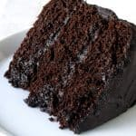

# Chocolate Cake

+ butter and flour for coating and dusting the cake pan
+ 3 cups all-purpose flour
+ 3 cups granulated sugar
+ 1 1/2 cups unsweetened cocoa powder
+ 1 tablespoon baking soda
+ 1 1/2 teaspoons baking powder
+ 1 1/2 teaspoons salt
+ 4 large eggs
+ 1 1/2 cups buttermilk
+ 1 1/2 cups warm water
+ 1/2 cup vegetable oil
+ 2 teaspoons vanilla extract

### INSTRUCTIONS -The Most Amazing Chocolate Cake

  
+ Preheat oven to 350 degrees Fahrenheit. Butter three 9-inch cake rounds. Dust with flour and tap out the excess.
+ Mix together flour, sugar, cocoa, baking soda, baking powder, and salt in a stand mixer using a low speed until combined.
+ Add eggs, buttermilk, warm water, oil, and vanilla. Beat on a medium speed until smooth. This should take just a couple of minutes.
+ Divide batter among the three pans. I found that it took just over 3 cups of the batter to divide it evenly.
+ Bake for 30-35 minutes in a 350 degree oven until a toothpick inserted into the center comes out clean.
+ Cool on wire racks for 15 minutes and then